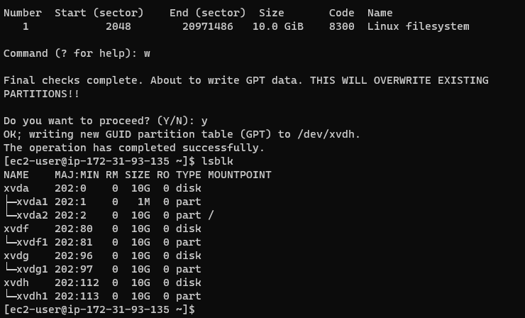
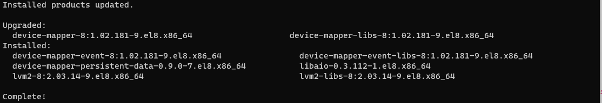
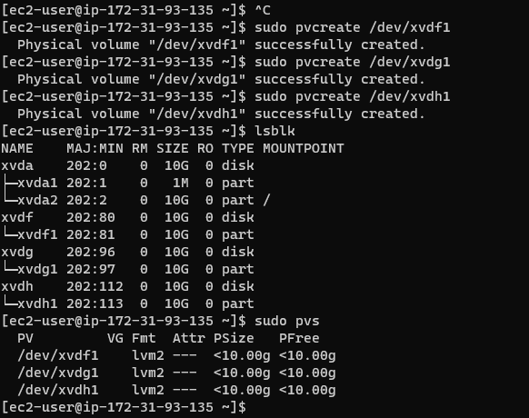
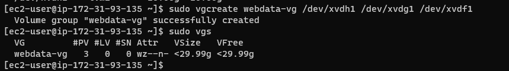

## **Documentation for Project 7**

### Entire View of partitioned Volume 
`lsblk`

### LVM2 Installation
`sudo yum install lvm2`

### Partition Marked as Physical Volume
`sudo pvcreate /dev/xvdf1`
`sudo pvcreate /dev/xvdg1`
`sudo pvcreate /dev/xvdh1`
`sudo pvs`

### Creating a Volume Group
`sudo vgcreate webdata-vg /dev/xvdh1 /dev/xvdg1 /dev/xvdf1`
`sudo vgs`
