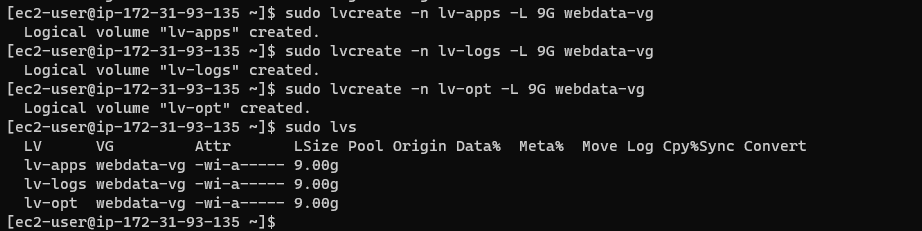
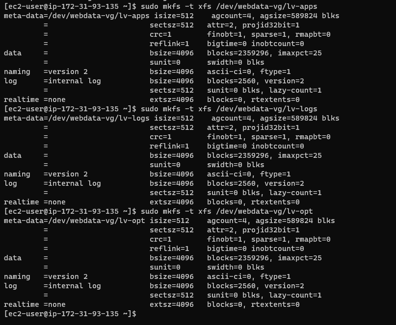
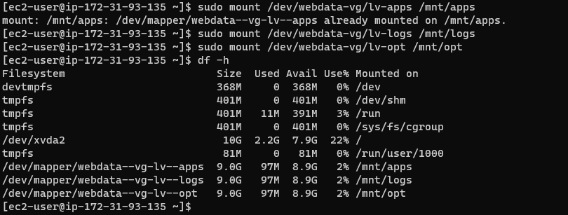
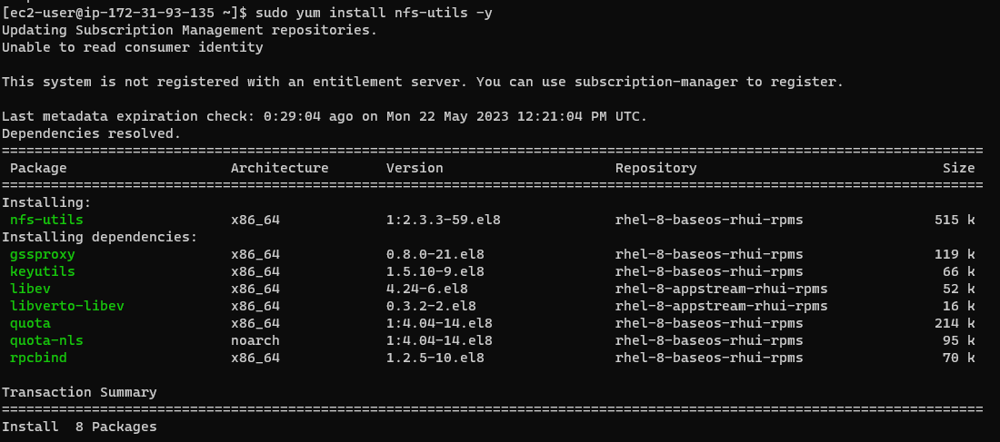
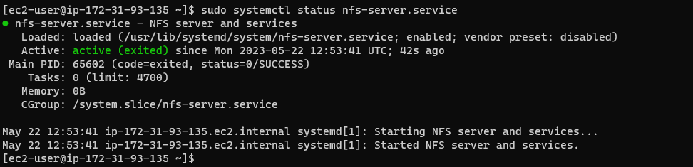
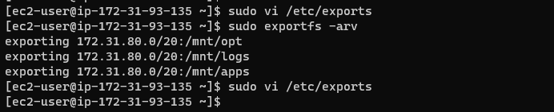

## **Documentation for Project 7**

### Entire View of partitioned Volume 
`lsblk`

### LVM2 Installation
`sudo yum install lvm2`

### Partition Marked as Physical Volume
`sudo pvcreate /dev/xvdf1`
`sudo pvcreate /dev/xvdg1`
`sudo pvcreate /dev/xvdh1`
`sudo pvs`

### Creating a Volume Group
`sudo vgcreate webdata-vg /dev/xvdh1 /dev/xvdg1 /dev/xvdf1`
`sudo vgs`

### Creating Logical Volume
`sudo lvcreate -n lv-apps -L 9G webdata-vg`
`sudo lvcreate -n lv-logs -L 9G webdata-vg`
`sudo lvcreate -n lv-opt -L 9G webdata-vg`
`sudo lvs`

### Formatting Logical Volume as xfs
`sudo mkfs -t xfs /dev/webdata-vg/lv-apps`
`sudo mkfs -t xfs /dev/webdata-vg/lv-logs`
`sudo mkfs -t xfs /dev/webdata-vg/lv-opt`

### Mounting our logical volumes on their respective directories
`sudo mount /dev/webdata-vg/lv-apps /mnt/apps`
`sudo mount /dev/webdata-vg/lv-logs /mnt/logs`
`sudo mount /dev/webdata-vg/lv-opt /mnt/opt`

## Preparing NFS Server
`sudo yum -y update`
`sudo yum install nfs-utils -y`

### NFS Server Running
`sudo systemctl start nfs-server.service`
`sudo systemctl enable nfs-server.service`
`sudo systemctl status nfs-server.service`

## Exporting our mounts for access by clients within the same subnet cidr
`sudo vi /etc/exports`
`sudo exportfs -arv`

## Opening TCP and UDP Ports for access by webservers under security Group
