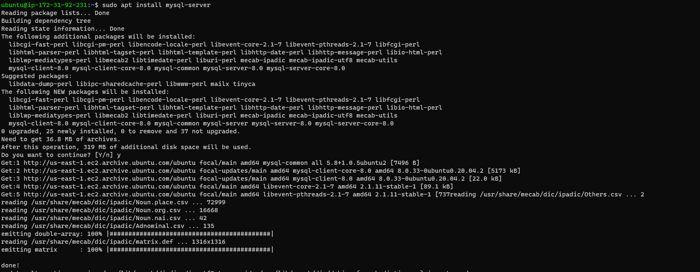
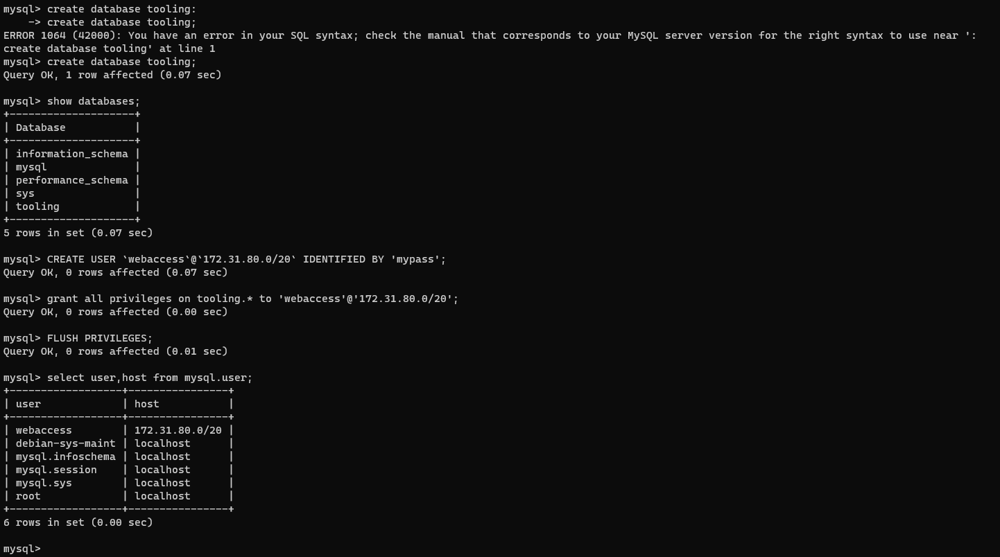

## **Documentation for Project 7**

### Entire View of partitioned Volume 
`lsblk`

### LVM2 Installation
`sudo yum install lvm2`

### Partition Marked as Physical Volume
`sudo pvcreate /dev/xvdf1`
`sudo pvcreate /dev/xvdg1`
`sudo pvcreate /dev/xvdh1`
`sudo pvs`

### Creating a Volume Group
`sudo vgcreate webdata-vg /dev/xvdh1 /dev/xvdg1 /dev/xvdf1`
`sudo vgs`

### Creating Logical Volume
`sudo lvcreate -n lv-apps -L 9G webdata-vg`
`sudo lvcreate -n lv-logs -L 9G webdata-vg`
`sudo lvcreate -n lv-opt -L 9G webdata-vg`
`sudo lvs`

### Formatting Logical Volume as xfs
`sudo mkfs -t xfs /dev/webdata-vg/lv-apps`
`sudo mkfs -t xfs /dev/webdata-vg/lv-logs`
`sudo mkfs -t xfs /dev/webdata-vg/lv-opt`

### Mounting our logical volumes on their respective directories
`sudo mount /dev/webdata-vg/lv-apps /mnt/apps`
`sudo mount /dev/webdata-vg/lv-logs /mnt/logs`
`sudo mount /dev/webdata-vg/lv-opt /mnt/opt`

## Preparing NFS Server
`sudo yum -y update`
`sudo yum install nfs-utils -y`

### NFS Server Running
`sudo systemctl start nfs-server.service`
`sudo systemctl enable nfs-server.service`
`sudo systemctl status nfs-server.service`

## Setting Read and Write Permission on NFS Server for Webservers to read and write on NFS
`sudo chown -R nobody: /mnt/apps`
`sudo chown -R nobody: /mnt/logs`
`sudo chown -R nobody: /mnt/opt`

`sudo chmod -R 777 /mnt/apps`
`sudo chmod -R 777 /mnt/logs`
`sudo chmod -R 777 /mnt/opt`

`sudo systemctl restart nfs-server.service`

## Exporting our mounts for access by clients within the same subnet cidr
`sudo vi /etc/exports`
`sudo exportfs -arv`

## Opening TCP and UDP Ports for access by webservers under security Group

## **Configuring Database Server**
`sudo apt update`
`sudo apt install mysql-server`

### Creating Database tooling and User
`create database tooling;`
`create user 'webaccess'@'172.31.80.0/20' identified by 'mypass';`
`grant all privileges on tooling.* to 'webaccess'@'172.31.80.0/20';`
`flush privileges;`

### Installing NFS Client on Webserver
`sudo yum install nfs-utils nfs4-acl-tools -y`

### Connecting to tooling database from Webserver
`mysql -h 172.31.92.231 -u webaccess -p tooling < tooling-db.sql`

### Mounting /var/www/ and target the NFS server’s export for apps

### Make sure that the changes will persist on Web Server after reboot:

`sudo mkdir /var/www`
`sudo mount -t nfs -o rw,nosuid 172.31.93.135:/mnt/apps /var/www`
`sudo vi /etc/fstab`
`172.31.93.135:/mnt/apps /var/www nfs defaults 0 0`

### Installing Remi’s repository, Apache and PHP
`sudo yum install httpd -y`

`sudo dnf install https://dl.fedoraproject.org/pub/epel/epel-release-latest-8.noarch.rpm`

`sudo dnf install dnf-utils http://rpms.remirepo.net/enterprise/remi-release-8.rpm`

`sudo dnf module reset php`

`sudo dnf module enable php:remi-7.4`

`sudo dnf install php php-opcache php-gd php-curl php-mysqlnd`

`sudo systemctl start php-fpm`

`sudo systemctl enable php-fpm`

`sudo setsebool -P httpd_execmem 1`

### Installing git to allow forking of website
`sudo yum install git`

### cloning tooling repo from git account
`git init`
`git clone https://github.com/darey-io/tooling.git`

### Deploying html folder from repo to /var/www/html
`sudo cp -R html/. /var/www/html`

### Accessing the tooling database forked from github from Database

### Tooling Website Live

### Accessing the tooling database forked from github from Database

### Logged in with admin info

